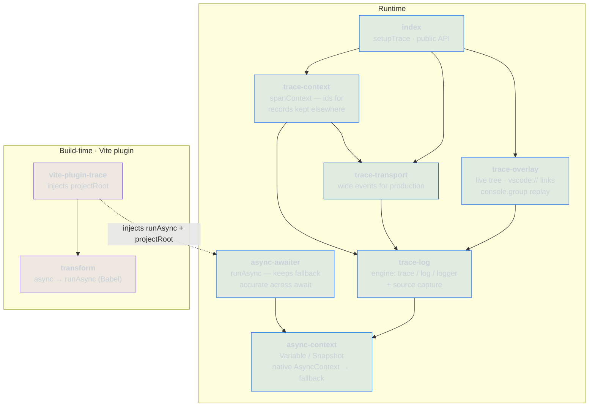

> **Moved.** This project now lives in
> [cbcruk/cdr](https://github.com/cbcruk/cdr) as `packages/console-trace`,
> where it is an internal workspace package rather than something to install.
> This repository is archived and kept for its history.

# console-trace

Async-aware tracing for the browser. `trace()` builds a span tree that survives
module boundaries and `await` — no context argument threading — and renders it as
a live overlay (with jump-to-source links) plus a `console.group` replay.

## How it fits together



Arrows point from a module to what it depends on: `async-context` is the
foundation, `trace-log` is the engine built on it, and `index` is the public
API on top. The Vite plugin is a separate build-time concern that feeds
`projectRoot` (for source links) and the `runAsync` import (for the async
transform) back into the runtime.

Each parent/child edge is recorded synchronously when `trace()` is called, so
**synchronous** nesting is always correct and no spans are lost. Attribution
across an `await` — both ambient `log()` and a `trace()` that runs after the
await — depends on context propagation: exact in `native` mode (real
`AsyncContext`), but in `fallback` mode a plain `await` drops the context and
such calls attach to the root. Use `runAsync` (see `async-awaiter`) to keep the
fallback accurate across await.

## Install

Not on npm — the name is taken by an unrelated package. Install from the
repository, which builds on install:

```bash
pnpm add github:cbcruk/console-trace
```

A lockfile pins the resolved commit, so `--frozen-lockfile` installs stay
reproducible. Building on install needs the package's own dev dependencies, so
the first install is slower than a registry one.

## Setup

```ts
// vite.config.ts
import { tracePlugin } from 'console-trace/vite-plugin-trace'
export default defineConfig({ plugins: [tracePlugin()] })

// main.tsx
import { setupTrace } from 'console-trace'
setupTrace()
```

`tracePlugin()` injects the project root so each log node gets a
`vscode://file/...` link. Without the plugin, tracing still works — the links
are just disabled.

The overlay supports collapsing spans and filtering by log level; both are
persisted to `localStorage` and restored across reloads.

### Fallback accuracy across `await`

In `fallback` mode a plain `await` drops the ambient span (see above). Enable
the transform to fix it — it downlevels `async` functions to generators driven
by `runAsync`, so the context is restored on every resume:

```ts
tracePlugin({ transform: true })
```

The transform uses Babel, declared as an optional peer dependency — install
`@babel/core` when you enable it. `for await...of` is rejected with a clear
error rather than miscompiled. In `native` mode the transform is unnecessary.

> **New to `AsyncContext`?** Step through why synchronous nesting is always
> exact, why a plain `await` leaks the span in `fallback` mode, and how
> `Snapshot` + `runAsync` restore it — one execution step at a time — in the
> interactive explainer: [docs/async-context.html](docs/async-context.html)
> (open it in a browser).

## Usage

```ts
import { trace, logger } from 'console-trace'

await trace('checkout', async () => {
  logger.info('cart validated')
  await processPayment() // trace/log in payment.ts attaches to this tree
  logger.info('done')
})
```

## Stamping records kept elsewhere

The span tree is one consumer of the ambient span. Another is any recorder that
keeps its own records and wants to say which operation each one belongs to.
`spanContext()` returns the active span as flat correlation fields, ready to
merge into whatever per-record hook that recorder offers:

```ts
import { spanContext, trace } from 'console-trace'

const recorder = new Recorder({ enrich: spanContext })

trace('checkout.submit', () => {
  recorder.warn('validation blocked') // carries trace_id / span_id / parent_id
})
```

This is the point of an ambient span expressed as data. The recorder sits deep
in a call stack and never receives the operation as an argument, yet its records
come out grouped by it.

Outside any `trace()` the result is empty and spreads to nothing, which also
covers tracing being disabled. Absent ids mean the record was unattributed,
never that it was unrelated — a record written from a timer or a later event
dispatch lands on the root in `fallback` mode, so it carries no ids rather than
the wrong ones. `trace_mode` travels with the ids so a reader knows how far to
trust the grouping.

The ids are counters scoped to one document, so pair them with a session
identifier before comparing records from more than one run.

## Production transport

In production, skip the overlay and stream span boundaries as wide events
(`trace_id` / `span_id` / `parent_id`) to your observability backend. Set
`retain: false` so completed spans are not held by the in-memory tree — events
flow out but memory does not grow:

```ts
setupTrace({
  overlay: false,
  retain: false,
  captureSource: false,
  transport(event) {
    fetch('/v1/events', { method: 'POST', body: JSON.stringify(event) })
  },
})
```

One `WideEvent` is emitted per span on completion, with its logs folded in.
`captureSource: false` skips the stack trace each `trace()` and `log()` would
otherwise build for its jump-to-source link, which is the most expensive part
of recording a span and buys nothing where the links are not shown.

## Development

```bash
vp install   # install dependencies
vp test      # run unit tests
vp check     # format, lint, type check
vp pack      # build the library
```
