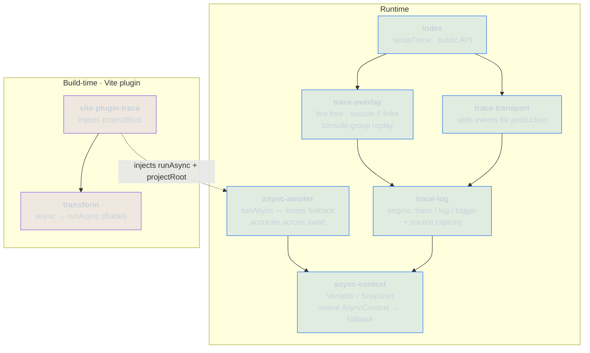

# console-trace

Async-aware tracing for the browser. `trace()` builds a span tree that survives
module boundaries and `await` — no context argument threading — and renders it as
a live overlay (with jump-to-source links) plus a `console.group` replay.

## How it fits together



Arrows point from a module to what it depends on: `async-context` is the
foundation, `trace-log` is the engine built on it, and `index` is the public
API on top. The Vite plugin is a separate build-time concern that feeds
`projectRoot` (for source links) and the `runAsync` import (for the async
transform) back into the runtime.

Each parent/child edge is recorded synchronously when `trace()` is called, so
**synchronous** nesting is always correct and no spans are lost. Attribution
across an `await` — both ambient `log()` and a `trace()` that runs after the
await — depends on context propagation: exact in `native` mode (real
`AsyncContext`), but in `fallback` mode a plain `await` drops the context and
such calls attach to the root. Use `runAsync` (see `async-awaiter`) to keep the
fallback accurate across await.

## Setup

```ts
// vite.config.ts
import { tracePlugin } from 'console-trace/vite-plugin-trace'
export default defineConfig({ plugins: [tracePlugin()] })

// main.tsx
import { setupTrace } from 'console-trace'
setupTrace()
```

`tracePlugin()` injects the project root so each log node gets a
`vscode://file/...` link. Without the plugin, tracing still works — the links
are just disabled.

The overlay supports collapsing spans and filtering by log level; both are
persisted to `localStorage` and restored across reloads.

### Fallback accuracy across `await`

In `fallback` mode a plain `await` drops the ambient span (see above). Enable
the transform to fix it — it downlevels `async` functions to generators driven
by `runAsync`, so the context is restored on every resume:

```ts
tracePlugin({ transform: true })
```

The transform uses Babel, declared as an optional peer dependency — install
`@babel/core` when you enable it. `for await...of` is rejected with a clear
error rather than miscompiled. In `native` mode the transform is unnecessary.

## Usage

```ts
import { trace, logger } from 'console-trace'

await trace('checkout', async () => {
  logger.info('cart validated')
  await processPayment() // trace/log in payment.ts attaches to this tree
  logger.info('done')
})
```

## Production transport

In production, skip the overlay and stream span boundaries as wide events
(`trace_id` / `span_id` / `parent_id`) to your observability backend. Set
`retain: false` so completed spans are not held by the in-memory tree — events
flow out but memory does not grow:

```ts
setupTrace({
  overlay: false,
  retain: false,
  transport(event) {
    fetch('/v1/events', { method: 'POST', body: JSON.stringify(event) })
  },
})
```

One `WideEvent` is emitted per span on completion, with its logs folded in.

## Development

```bash
vp install   # install dependencies
vp test      # run unit tests
vp check     # format, lint, type check
vp pack      # build the library
```
